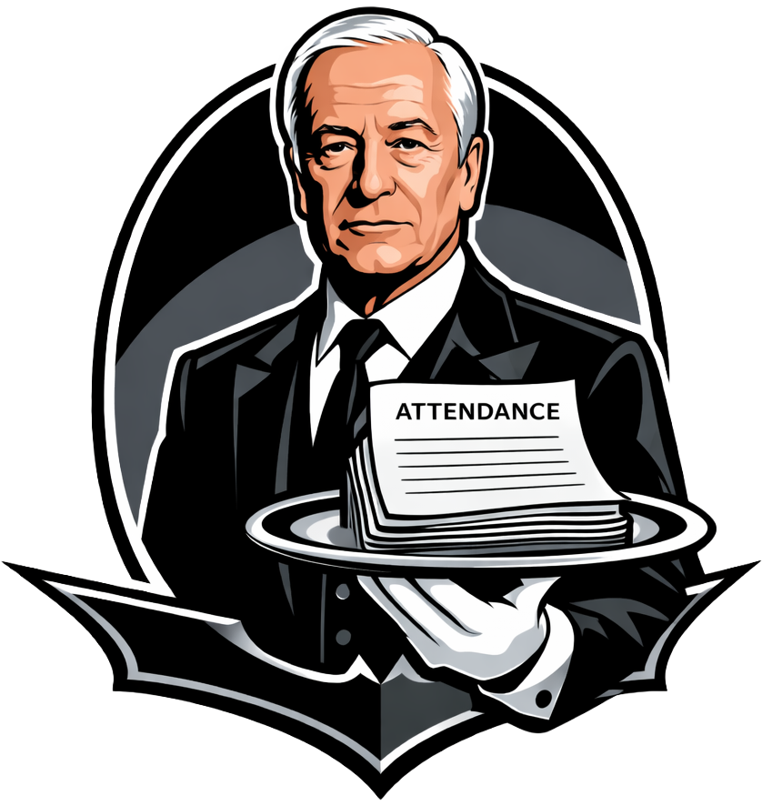
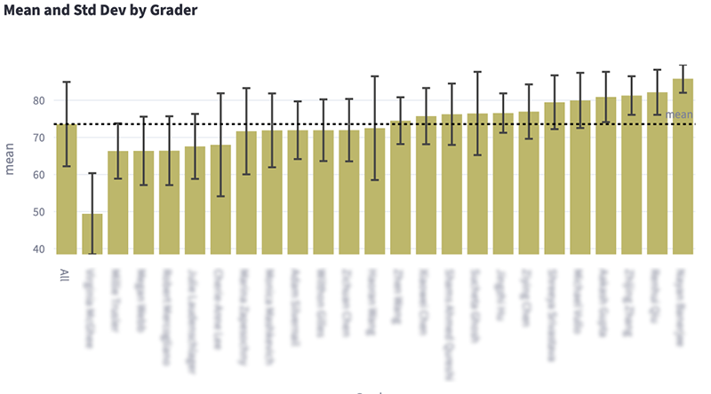
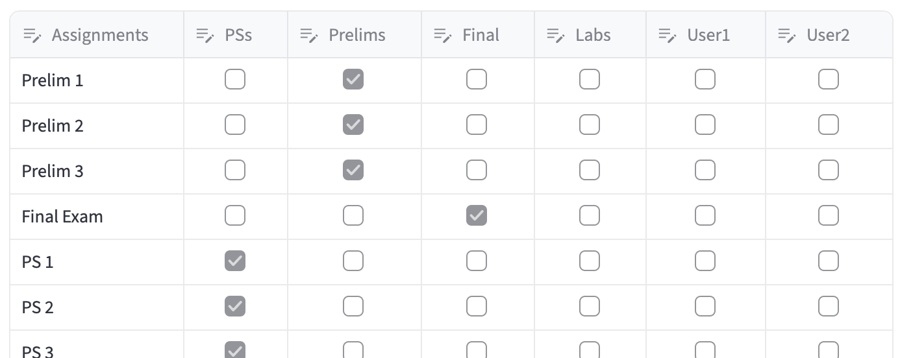
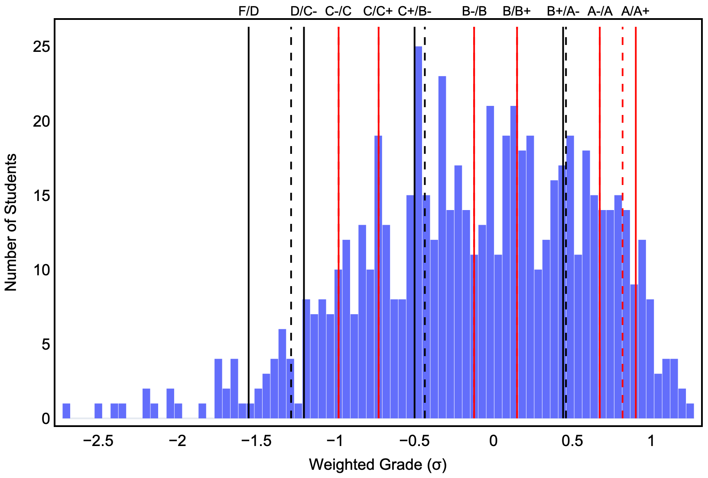
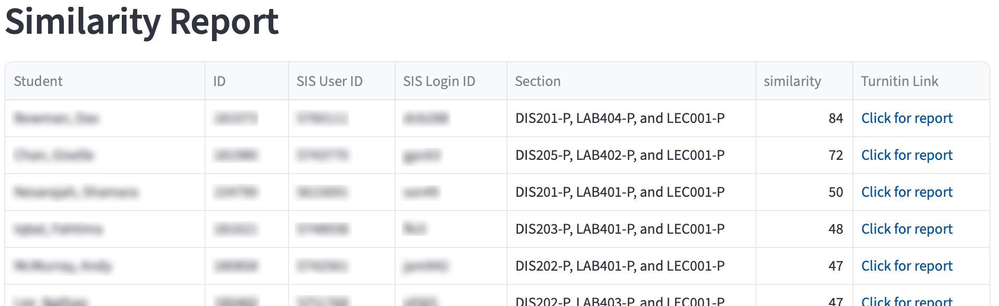
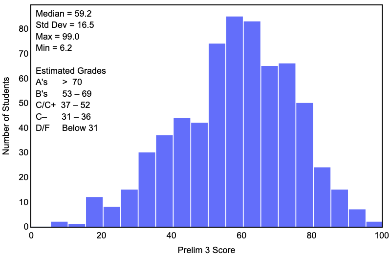

# Alfred – A Streamlit package to manage Chemistry courses 

    

## Analyze Attendance

This module reads the attendance data stored in a private Google sheet and prepares an attendance report.

## Analyze Grades

This module analyzes grading stored in a folder of Gradescope scores for an assignment, producing a grader-by-grader analysis as shown below.  

To perform the analysis, open the assignment in Gradescope and select "Export Evaluations" at the bottom of the page. Drag the resulting folder from your Downloads folder onto "Drag and drop files here." Give the analysis a name in the modal dialog. An analysis of all problems will appear. To analyze a single problem, use the dropdown menu in the sidebar to select it.

## Calculate/Estimate Final Grades

This module calculates/estimates final grades using standard or 'z scoring.' This is described in detail [on Wikipedia](https://en.wikipedia.org/wiki/Standard_score). The z score can be calculated with respect to the median grade (default) or the mean.

The user first enters a few parameters for the calculation. A Canvas gradebook csv is then loaded. The user is then prompted to categorize each grade by assignment type (e.g., Problem Set, Prelim, Final, Lab, User1, User2). Uncategorized grades are not included in the average. The rubric (weighting) of each assignment type is then entered. There is an option to set blank values to zero for each type of assignment. (The best practice would be to do this in Canvas before downloading the grades.) Grades of 'EX' (or any other text) are treated as excused absences.

The assignment classification interface is shown below.

    

After these data are entered, grades are calculated using the departmental grade distribution as a first shot. The user can then tweak the grade cutoffs while monitoring the grade distribution and statistics. The grade cutoffs are visualized as vertical solid lines, as shown below. The dashed lines represent the departmental suggested cutoffs (if different from the user cutoffs.)

    

Once the user is satisfied with the cutoffs, all of the data (updated gradebook, grade cutoffs, grade statistics, and grade histogram) are saved to separate sheets in a .xslx file.

_Note 1:_ Text in a grade column is presumed to be an excused absence ('EX').

_Note 2:_ You may be given the option to "Skip students with missing grades." (You will be told which students have missing grades, so you should fix this if possible.) If you do skip these students, they will not have their weighted average calculated or any estimated grades. You may be able to see some component averages (_e.g.,_ Lab_avg_) if there are sufficient grades. This option is only included in case students are only completing part of the course for some very unusual reason.

## Combine PS Scores

This module combines problem set (PS) scores from Gradescope and Pearson using the weighting defined in Settings, then prepares a csv for upload to Canvas.  

_Note:_ This script preserves any 'EX' entries in the Canvas gradebook. No grade is recorded for a pre-existing 'EX'.

## Combine Lab Scores

This module combines prelab and postlab scores from Gradescope with any late penalties calculated from the Canvas Late Report to generate the total lab score. The module then prepares a csv for upload to Canvas.

This module reads in 3 csv's:  
&emsp;&emsp;Canvas gradebook  
&emsp;&emsp;Canvas Late Report, generated from Late Assignments in Course Analytics  
&emsp;&emsp;Gradescope gradebook 
 
The module assumes that:  
&emsp;– The names of the pre- and post-lab assignments start with the same word in Gradebook and in Canvas  
&emsp;– That starting word is unique to the lab  
&emsp;– The pre- and post-lab assignments have "pre-lab" and "post-lab" in the assignment names   

The script gives a 10 min grace period as per Cynthia

_Note:_ This script preserves any 'EX' entries in the Canvas gradebook. No grade is recorded for a pre-existing 'EX'.

## Get Turnitin Similarities  

This module queries Canvas for all of the Turnitin similarity scores for a single assignment using the current Canvas gradebook. The scores are output in a csv that includes a link each student’s Turnitin report as shown below.

    

  
This module requires:  
&emsp;– a Canvas token be stored via Settings, and   
&emsp;– the base URL of the Canvas instance be set in Settings.

## Make Histogram

This module produces a histogram of grades from a Gradescope csv and optionally calculates the estimated grade cutoffs based on the course median. This module requires Chrome be installed on your computer for the png output. A sample histogram is shown below.  

## Transfer Grades to Faculty Center Roster

This module reads an Excel file containing (at least) a column of Cornell IDs / SIS User IDs and assigned letter grades on the same sheet. The Excel file can contain many more columns (_e.g.,_ all of your grade calculations) and many other sheets. The module then reads your Faculty Center Roster(s), which are csv's. The module copies the grades from the Excel file to the Faculty Center Roster by comparing Cornell IDs. The final combined roster is output as a csv ready for upload to Faculty Center.

If you have multiple roster files, the script produces a single combined roster that Faculty Center has no problems accepting.

## Update Roster

This module compare the current Canvas roster, as given by the Canvas gradebook, with the current Alfred roster, which is read from the shared Google sheet. The script then adds any new enrollees to the Alfred roster upon request.

## Add Student IDs to Pearson Roster

This module adds student IDs pulled from the current Canvas gradebook to the Pearson roster. The matching is performed based on netID (default) or student name (backup). The module produces a csv which is used to update the Pearson roster, which is then reuploaded to Pearson.

## Settings

This module handles the settings for the various modules. The data are stored in Alfred/.streamlit/prefs.toml. The file can also be edited with a text editor.

## Installation
– Use Anaconda to make an env containing numpy, streamlit, pandas, plotly, tomlkit, git  
– pip install gspread oauth2client  
– pip install watchdog  
– pip install --upgrade kaleido  (see _Note 3_ below)  
– pip install canvasapi
– pip install keyring   
– cd to folder that will contain Alfred  
– git clone https://github.com/MAHines/Alfred.git   
– copy secrets.toml to Alfred/.streamlit

_Note 1:_ The folder Alfred/.streamlit is hidden by default. To show/hide invisible folders on a Mac, press command + shift + . (period).  

_Note 2:_ To obtain secrets.toml for Cornell Chemistry, e-mail Melissa.Hines@cornell.edu. 

_Note 3:_ The kaleido package [requires Chrome](https://www.google.com/chrome/) to be on your computer. If you have difficulty installing kaleido, your pip may be out of date. If so, run
    
–  python -m pip install --upgrade pip

## Running Alfred from the command line
– cd to Alfred folder  
– streamlit run Alfred.py  

## Updating Alfred from the command line
– cd to Alfred folder  
– git pull  

